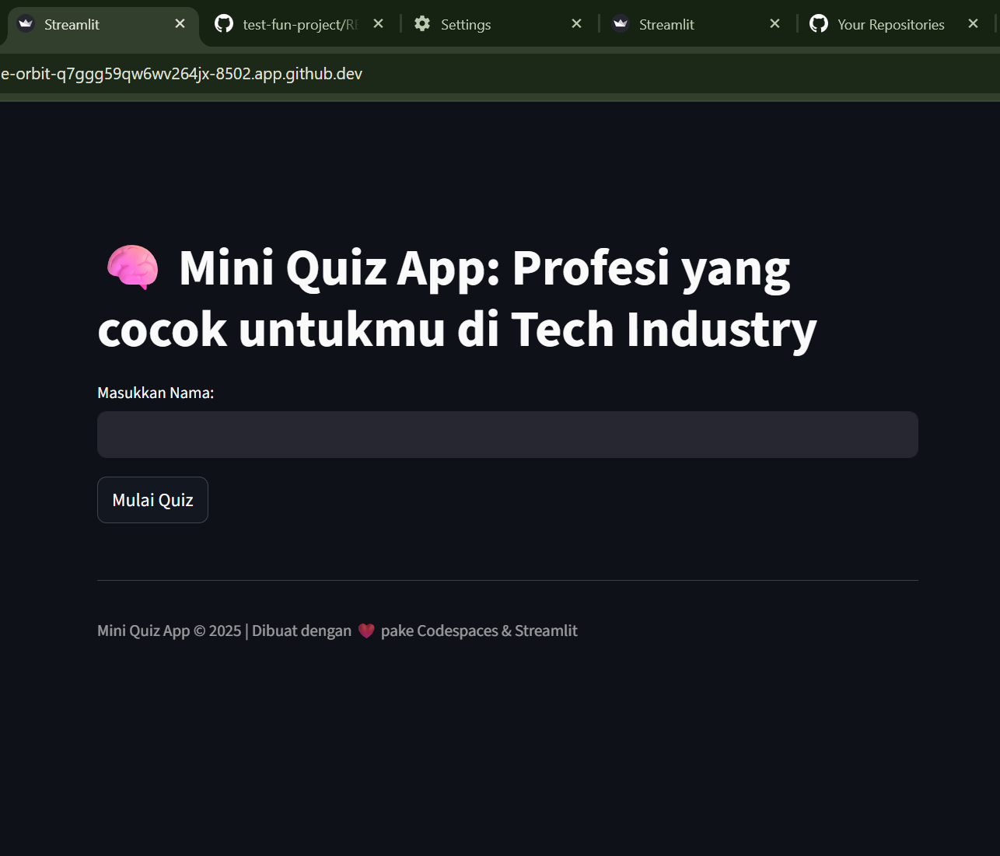
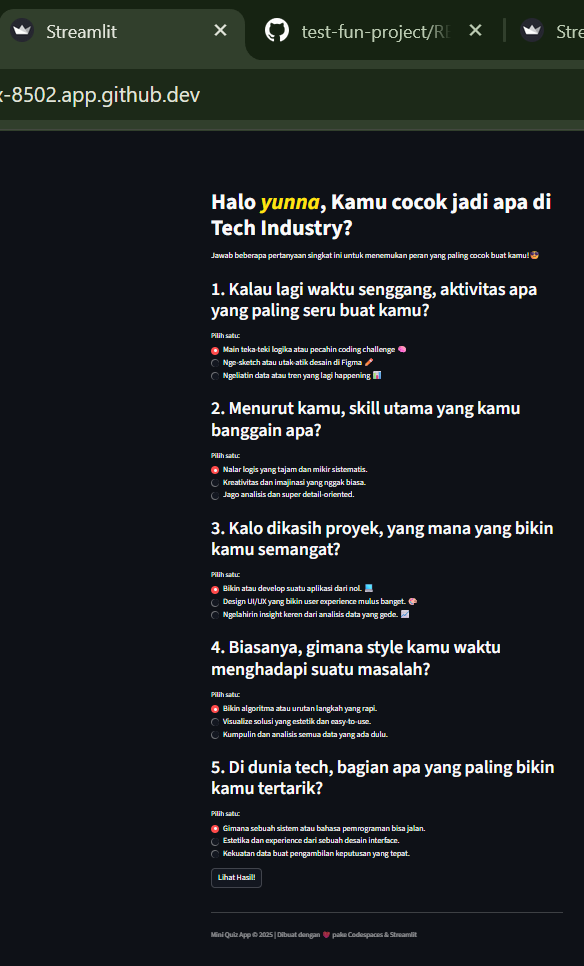
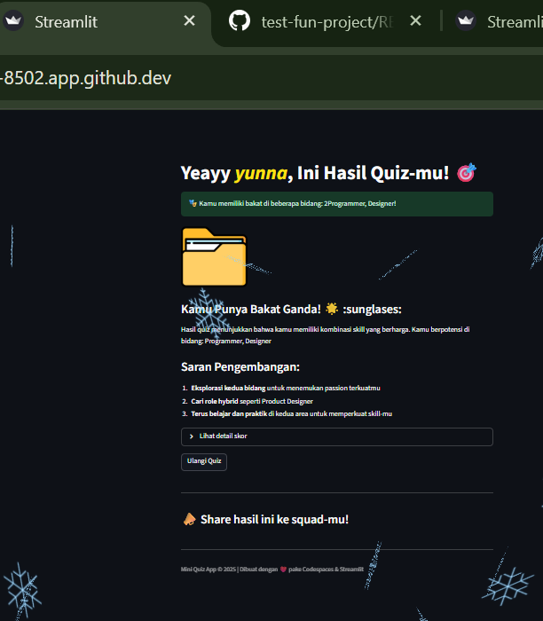

test-fun-project 
#README.md for Mini Quiz App

### **Mini Quiz App: Profesi yang cocok untukmu di Tech Industry!**
Aplikasi kuis interaktif yang dibangun dengan Streamlit untuk membantu kamu menemukan profesi di industri teknologi yang paling sesuai dengan kepribadian dan skill-mu.

### **Key Features**
- **Multiple Choice Questions (Radio Buttons)**: Menampilkan serangkaian pertanyaan dengan pilihan jawaban menggunakan **radio buttons**.
- **Penilaian Berdasarkan Jawaban**: Menghitung skor untuk masing-masing kategori (Programmer, Designer, Data Scientist) berdasarkan jawaban yang dipilih pengguna. 
- **Analisis Hasil**: Menyajikan deskripsi, job deskripsi, dan keterampilan yang diperlukan untuk 3 profesi tech: Programmer, Designer, dan Data Scientist. Serta saran karier hybrid untuk pengguna dengan multitalenta.
- **UI yang Menarik dan Ramah Pengguna**: Dilengkapi dengan gambar, pesan hasil, serta efek visual yang menarik. Beberapa fitur tombol untuk mempermudah penggunaan (melihat hasil tes, memulai ulang tes, berbagi hasil ke media sosial).

### **Prerequisites**
Sebelum menjalankan, pastikan kamu telah memiliki:
*   Python 3.8+ terinstall
*   Package manager `pip`

### **Cara Menjalankan**
1. Pastikan Python terinstall di perangkatmu
2. Install Streamlit:
   ```bash
   pip install streamlit

3. Clone atau download project ini
4. Jalankan aplikasi:
   ```bash
   streamlit run nama_file.py
   ```
5. Buka browser dan akses alamat yang ditampilkan (Contoh: http://localhost:8501)

### **Cara Menggunakan**
1. Masukkan nama kamu di halaman pertama
2. Jawab 5 pertanyaan dengan jujur sesuai kepribadianmu
3. Lihat hasilnya dan temukan profesi tech yang paling cocok untukmu!
4. Bagikan hasilnya ke teman-temanmu

### **Profesi yang Dideteksi**
- **Programmer** - Ahli dalam logika dan pemecahan masalah dengan kode
- **Designer** - Kreatif dengan kemampuan estetika dan user experience
- **Data Scientist** - Jago analisis data dan menemukan pola tersembunyi

## **Preview Aplikasi**
**_Halaman Utama_ :**



**_Halaman Pertanyaan_ :**



**_Halaman Hasil Quiz_ :**



### **Tech Stack & Dependencies**
*   **Bahasa**: Python 3.12.1
*   **Framework**: [](https://streamlit.io/)
*   **Deployment**: Streamlit Community Cloud
*   **Version Control**: Git & GitHub

### **Pertanyaan Umum (FAQ)**

**Q: Seberapa akurat kuis ini?**
A: Ini adalah project fun yang berdasarkan traits kepribadian umum yang terkait dengan peran tech. Ini adalah titik awal yang bagus untuk eksplorasi, bukan assessment ilmiah!

**Q: Saya dapat hasil hybrid. Apa artinya?**
A: Artinya jawaban kamu menunjukkan kecocokan yang kuat di lebih dari satu area! Ini pertanda bagus. Banyak pekerjaan tech yang menarik saat ini berada di persimpangan berbagai skill.

**Q: Bisakah saya berkontribusi pada project ini?**
A: Untuk saat ini, project ini adalah proyek mandiri dan tertutup untuk kontribusi eksternal. Namun, feel free untuk fork repo ini dan modifikasi untuk keperluan pembelajaran kamu sendiri!